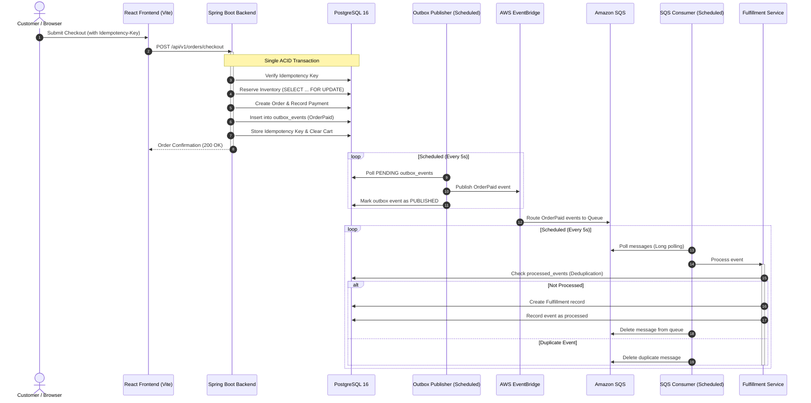

# KarigarSetu

An e-commerce order processing and fulfillment platform built with **Spring Boot**, **PostgreSQL**, **AWS (EventBridge & SQS)**, and **React**.

---

## Overview

**KarigarSetu** is an e-commerce platform connecting authentic Indian artisanal crafts with a reliable order fulfillment backend. The system implements core distributed patterns:

- **Transactional Outbox Pattern**: Decouples database transactions from message publishing to prevent dual-write inconsistencies.
- **Idempotency Handling**: Client-side idempotency keys for checkout and database-backed event deduplication for SQS consumers.
- **Pessimistic Inventory Locking**: Uses `SELECT ... FOR UPDATE` row locks to prevent overselling during concurrent checkout requests.
- **Asynchronous Fulfillment**: Orders are fulfilled asynchronously via AWS EventBridge and Amazon SQS queues with DLQ retry handling.
- **Observability**: Spring Boot Actuator health checks, Prometheus metrics, and correlation ID (MDC) request tracing.

---

## Architecture & Event Flow

The synchronous checkout transaction is decoupled from downstream asynchronous fulfillment processing:



---

## Key Technical Patterns

### 1. Transactional Outbox
Publishing directly to an external message broker inside an active database transaction risks dual-write anomalies (e.g. database commits, but the broker connection drops). KarigarSetu writes an `OrderPaid` event to the `outbox_events` table in the same transaction as the order creation. A scheduled background worker (`OutboxPublisher`) then polls pending events and publishes them to AWS EventBridge with retry tracking (up to 5 retries before marking as failed).

### 2. Double-Sided Idempotency
- **Checkout Ingestion:** The `/api/v1/orders/checkout` endpoint requires an `Idempotency-Key` header. Duplicate requests return the original response without duplicate order creation or billing.
- **Consumer Processing:** The SQS consumer checks the `processed_events` table prior to fulfillment. If an event ID was already processed, it deletes the redundant message and skips re-fulfillment.

### 3. Pessimistic Inventory Locking
To avoid overselling when multiple users purchase the same item concurrently, `InventoryService` acquires row-level locks via `findByIdForUpdate` (`SELECT ... FOR UPDATE`). Other concurrent checkout transactions for that item wait until the current transaction commits or rolls back.

### 4. Asynchronous Cloud Fulfillment
AWS EventBridge routes paid order events to an Amazon SQS queue. The SQS consumer uses long-polling to retrieve messages, processes fulfillment records in the database, and deletes completed messages. Unhandled errors leave the message in the queue for visibility timeout expiration and DLQ handling.

### 5. Authentication & Role-Based Access Control
Stateless authentication using JWT (HMAC-SHA256):
- **`CUSTOMER`**: Browse catalog, add items to cart, checkout orders, and view personal order history.
- **`ADMIN`**: Create products, upload images, update inventory stock, and monitor orders.

### 6. Observability & Tracing
- **Metrics:** Micrometer counters for business operations (`fulfillx.checkout.total`, `fulfillx.payment.success.total`, `fulfillx.payment.failure.total`, `fulfillx.inventory.failure.total`).
- **Actuator & Prometheus:** Health endpoints at `/actuator/health` and Prometheus scraping at `/actuator/prometheus`.
- **Request Tracing:** Correlation ID servlet filter attaches a unique correlation ID to every incoming request and includes it in log statements via MDC.

---

## Tech Stack

| Layer | Technologies |
|---|---|
| **Backend** | Java 17, Spring Boot, Spring Data JPA, Spring Security, Springdoc OpenAPI (Swagger) |
| **Database** | PostgreSQL 16, Flyway Migrations |
| **Messaging & Cloud** | AWS EventBridge, Amazon SQS & DLQ, Amazon S3, AWS SDK for Java v2 |
| **Frontend** | React 19, TypeScript, Vite, Tailwind CSS v3.4, React Router v7, Lucide Icons, Axios |
| **Containerization** | Docker, Docker Compose, Nginx |
| **Testing** | JUnit 5, Testcontainers (PostgreSQL 16), Mockito |

---

## Project Structure

```text
KarigarSetu/
├── compose.yaml                    # Multi-container Docker Compose configuration
├── .env.example                    # Sample environment variables
├── backend/
│   ├── pom.xml                     # Maven dependencies (Spring Boot, AWS SDK, Flyway)
│   ├── Dockerfile                  # Multi-stage Eclipse Temurin build
│   └── src/
│       ├── main/
│       │   ├── java/com/fulfillx/backend/
│       │   │   ├── config/         # Security, AWS, OpenAPI, Metrics, CORS, Tracing
│       │   │   ├── controller/     # Auth, Cart, Order, Product, User, Health REST APIs
│       │   │   ├── dto/            # Request and response DTOs
│       │   │   ├── entity/         # JPA Entities (Order, Cart, Product, OutboxEvent, etc.)
│       │   │   ├── event/          # SQS Consumer, EventBridge Publisher, Domain Events
│       │   │   ├── repository/     # Spring Data JPA Repositories
│       │   │   └── service/        # Order, Inventory, Outbox, Payment, Auth services
│       │   └── resources/
│       │       ├── application.properties
│       │       └── db/migration/   # Flyway SQL migrations (V1 to V12)
│       └── test/                   # Testcontainers integration tests
└── frontend/
    ├── package.json                # React 19, Vite, TypeScript, Tailwind CSS
    ├── Dockerfile                  # Multi-stage build with Nginx reverse proxy
    └── src/
        ├── api/                    # Axios API client and endpoints
        ├── components/             # Reusable UI components
        ├── context/                # AuthContext & CartContext
        ├── pages/                  # Home, Products, Cart, Orders, Admin Dashboard
        └── routes/                 # Protected and Admin route guards
```

---

## Database Migrations (Flyway)

Migrations are located in `backend/src/main/resources/db/migration/`:

| Version | File | Description |
|---|---|---|
| **V1** | `V1__create_products_table.sql` | Products table with SKU, category, stock checks, and indexes |
| **V2** | `V2__create_users_table.sql` | Users table with roles (`CUSTOMER`, `ADMIN`) and hashed passwords |
| **V3** | `V3__create_cart_and_order_tables.sql` | Carts, Cart Items, Orders, and Order Items tables |
| **V4** | `V4__create_inventory_reservations.sql` | Inventory reservations tracking allocations per order |
| **V5** | `V5__create_idempotency_keys.sql` | Client checkout idempotency keys table |
| **V6** | `V6__create_payments_table.sql` | Order payment records and transaction references |
| **V7** | `V7__create_fulfillment_table.sql` | Fulfillment records with status (`PENDING`, `PROCESSING`, `SHIPPED`) |
| **V8** | `V8__create_outbox_events_table.sql` | Transactional outbox event store (`PENDING`, `PUBLISHED`, `FAILED`) |
| **V9** | `V9__create_processed_events_table.sql` | SQS consumer event deduplication table |
| **V10** | `V10__add_artisan_and_handcraft_fields.sql` | Adds artisan name, origin town, state, and craft type |
| **V11** | `V11__seed_artisan_handcrafted_products.sql` | Seeds initial artisan product catalog |
| **V12** | `V12__seed_curated_pan_india_handicrafts.sql` | Seeds curated Pan-India handicrafts collection |

---

## API Reference

### Authentication
- `POST /api/v1/auth/register` — Register a customer account and receive a JWT.
- `POST /api/v1/auth/login` — Authenticate and receive a JWT.

### Products
- `GET /api/v1/products?category={cat}&page=0&size=20` — List active products (Public).
- `POST /api/v1/products` — Create a product (*Admin only*).
- `PUT /api/v1/products/{id}/stock?quantity={qty}` — Update inventory quantity (*Admin only*).
- `POST /api/v1/products/upload-url` — Generate S3 upload metadata for product image (*Admin only*).

### Shopping Cart (Authenticated)
- `GET /api/v1/cart` — Get current user's cart.
- `POST /api/v1/cart/items` — Add product to cart.
- `PUT /api/v1/cart/items/{itemId}` — Update item quantity in cart.
- `DELETE /api/v1/cart/items/{itemId}` — Remove item from cart.

### Orders & Checkout (Authenticated)
- `POST /api/v1/orders/checkout` — Checkout cart. Requires `Idempotency-Key` header.
- `GET /api/v1/orders?page=0&size=20` — Get paginated order history.
- `GET /api/v1/orders/{orderId}` — Get detailed order summary with fulfillment status.

### User & System
- `GET /api/v1/users/me` — Get profile and role of authenticated user.
- `GET /api/v1/health` — Basic backend health check.
- `GET /actuator/health` — Spring Boot Actuator health (Liveness & Readiness).
- `GET /actuator/prometheus` — Prometheus scraping metrics.
- `GET /swagger-ui.html` — Interactive Swagger UI documentation.

---

## Getting Started

### Prerequisites
- [Docker](https://www.docker.com/) and Docker Compose (Docker Desktop must be running)
- [Java 17+](https://adoptium.net/) (for local backend development without Docker)
- [Node.js 18+](https://nodejs.org/) & `npm` (for local frontend development without Docker)

---

### Option 1: Run with Docker Compose

1. **Copy the environment configuration:**
   ```bash
   cp .env.example .env
   ```
   Set `JWT_SECRET` in `.env` (and your AWS settings if connecting to live AWS resources).

2. **Start all services:**
   ```bash
   docker compose up --build
   ```

3. **Access points:**
   - **Frontend:** [http://localhost:5173](http://localhost:5173)
   - **Backend API:** [http://localhost:8080/api/v1](http://localhost:8080/api/v1)
   - **Swagger UI:** [http://localhost:8080/swagger-ui.html](http://localhost:8080/swagger-ui.html)
   - **Actuator Health:** [http://localhost:8080/actuator/health](http://localhost:8080/actuator/health)
   - **Prometheus Metrics:** [http://localhost:8080/actuator/prometheus](http://localhost:8080/actuator/prometheus)

---

### Option 2: Run Locally (Individual Services)

#### 1. Start PostgreSQL
```bash
docker run -d --name karigarsetu-postgres \
  -e POSTGRES_DB=karigarsetu \
  -e POSTGRES_USER=karigarsetu \
  -e POSTGRES_PASSWORD=karigarsetu_dev_password \
  -p 5432:5432 \
  postgres:16
```

#### 2. Run Backend
```bash
cd backend

# On Linux/macOS
./mvnw spring-boot:run

# On Windows
./mvnw.cmd spring-boot:run
```

#### 3. Run Frontend
```bash
cd frontend
npm install
npm run dev
```
The frontend dev server will launch at [http://localhost:5173](http://localhost:5173).

---

## Testing

Backend integration tests use **Testcontainers** with an isolated PostgreSQL 16 container:

```bash
cd backend
./mvnw test
```

---

## License

MIT