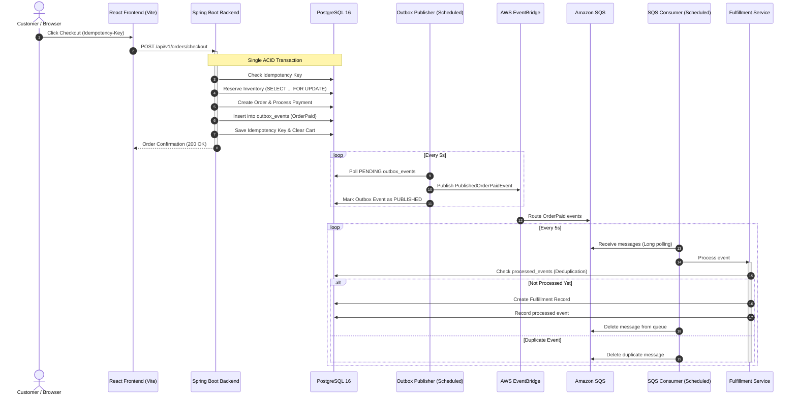

# FulfillX

> Production-style distributed ecommerce and fulfillment platform built with Spring Boot, React, PostgreSQL, and AWS event-driven services.

---

## Overview

**FulfillX** is a production-grade, distributed order processing and fulfillment system designed to demonstrate robust distributed systems patterns. It guarantees high availability, data consistency, and reliable asynchronous processing under concurrent load.

At its core, FulfillX tackles the classic challenges of distributed microservices and ecommerce platforms:
- **Dual-write consistency** using the **Transactional Outbox Pattern**.
- **At-least-once delivery handling** with **two-tier idempotency** (at checkout ingestion and SQS fulfillment consumption).
- **Zero overselling** via **pessimistic database locking** on inventory items during checkout.
- **Asynchronous fulfillment decoupled via AWS EventBridge and Amazon SQS**.
- **Observability** with Prometheus metrics, Spring Boot Actuator health checks, and correlation ID tracing.

---

## Architecture & Event Flow

The system decouples the synchronous user checkout flow from the asynchronous order fulfillment pipeline:



---

## Core Engineering Features

### 1. Transactional Outbox Pattern
Directly publishing events to an external message broker within a database transaction risks dual-write anomalies (e.g. database commits, but message broker connection drops). FulfillX writes the domain event (`OrderPaid`) into the `outbox_events` table within the same ACID database transaction as the order and payment. A background worker (`OutboxPublisher`) reliably polls and publishes events to AWS EventBridge with automatic retry tracking (up to 5 retries before marking permanently failed).

### 2. Double-Sided Idempotency
- **Ingress Idempotency:** The checkout endpoint enforces an `Idempotency-Key` HTTP header. Repeated requests with the same key replay the previous order response without re-charging the customer or re-reserving stock.
- **Egress/Consumer Idempotency:** The SQS consumer checks the `processed_events` table before executing fulfillment logic. Repeated delivery of the same message is safely deduplicated.

### 3. Concurrency Control & Inventory Reservation
During checkout, `InventoryService` acquires pessimistic database row locks (`SELECT ... FOR UPDATE` via `findByIdForUpdate`) on each product. This eliminates race conditions and guarantees stock will never be oversold during high-volume flash checkout bursts.

### 4. Asynchronous Cloud Fulfillment
Order payment events flow through AWS EventBridge to an Amazon SQS queue (`fulfillx-fulfillment-queue`). The consumer performs long-polling with visibility timeout management and message deletion upon successful processing. Unprocessable messages are retained for automatic Dead-Letter Queue (DLQ) redrive.

### 5. Role-Based Access Control & JWT Security
Stateless authentication using Spring Security and HMAC-SHA256 JWT tokens:
- **`CUSTOMER`**: Browse catalog, manage cart, checkout orders, view own order history.
- **`ADMIN`**: Create new products, update product stock levels, view administrative dashboards.

### 6. Observability & Operational Readiness
- **Metrics:** Custom Micrometer counters tracking business metrics:
  - `fulfillx.checkout.total`
  - `fulfillx.payment.success.total`
  - `fulfillx.payment.failure.total`
  - `fulfillx.inventory.failure.total`
- **Prometheus & Actuator:** Available at `/actuator/prometheus` and `/actuator/health`.
- **Tracing:** Correlation ID servlet filter assigns a unique correlation ID to each HTTP request and propagates it through log context (MDC).
- **OpenAPI / Swagger:** Interactive API documentation available at `/swagger-ui.html`.

---

## Tech Stack

| Layer | Technologies |
|---|---|
| **Backend** | Java 17, Spring Boot 4.1.1, Spring Data JPA, Spring Security, Springdoc OpenAPI (Swagger) |
| **Database** | PostgreSQL 16, Flyway Migrations |
| **Messaging & Cloud** | AWS EventBridge, Amazon SQS, AWS SDK for Java v2 (`2.29.50`) |
| **Frontend** | React 19, TypeScript, Vite, React Router v7, Axios, Modern Vanilla CSS |
| **DevOps & Containers** | Docker, Docker Compose, Nginx |
| **Testing** | JUnit 5, Testcontainers (PostgreSQL 16), Mockito |

---

## Project Structure

```text
fulfillx/
├── compose.yaml                    # Multi-container local production orchestration
├── .env.example                    # Sample root environment configuration
├── backend/
│   ├── pom.xml                     # Maven dependencies (Spring Boot, AWS SDK, Flyway)
│   ├── Dockerfile                  # Multi-stage Eclipse Temurin JRE build
│   └── src/
│       ├── main/
│       │   ├── java/com/fulfillx/backend/
│       │   │   ├── config/         # Security, AWS, OpenAPI, Metrics, CORS, MDC Tracing
│       │   │   ├── controller/     # Auth, Cart, Order, Product, User, Health REST APIs
│       │   │   ├── dto/            # Request / Response DTOs
│       │   │   ├── entity/         # JPA Entities (Order, Cart, Product, OutboxEvent, etc.)
│       │   │   ├── event/          # SQS Consumer, EventBridge Publisher, Domain Events
│       │   │   ├── repository/     # Spring Data JPA Repositories
│       │   │   └── service/        # Business logic (Order, Inventory, Outbox, Payment, Auth)
│       │   └── resources/
│       │       ├── application.properties
│       │       └── db/migration/   # Flyway SQL migrations (V1 to V9)
│       └── test/                   # Testcontainers integration test suite
└── frontend/
    ├── package.json                # React 19, Vite, TypeScript, Axios, React Router 7
    ├── Dockerfile                  # Multi-stage build with Nginx reverse proxy
    ├── nginx.conf                  # Nginx SPA fallback configuration
    └── src/
        ├── api/                    # Axios API client & endpoint definitions
        ├── components/             # Reusable UI components (Layout, ProductCard, etc.)
        ├── context/                # AuthContext for JWT state management
        ├── pages/                  # Products, Cart, Orders, Admin Dashboard, Login/Register
        └── routes/                 # Protected and Admin route guards
```

---

## Database Migrations (Flyway)

Database schema evolution is managed via versioned Flyway migrations under `backend/src/main/resources/db/migration/`:

| Version | Migration Script | Description |
|---|---|---|
| **V1** | `V1__create_products_table.sql` | Products table with SKU, category, stock checks, and indexes |
| **V2** | `V2__create_users_table.sql` | Users table with roles (`CUSTOMER`, `ADMIN`) and hashed passwords |
| **V3** | `V3__create_cart_and_order_tables.sql` | Carts, Cart Items, Orders, and Order Items tables |
| **V4** | `V4__create_inventory_reservations.sql` | Inventory reservations tracking allocations per order |
| **V5** | `V5__create_idempotency_keys.sql` | Client checkout idempotency keys table |
| **V6** | `V6__create_payments_table.sql` | Order payment status and transaction references |
| **V7** | `V7__create_fulfillment_table.sql` | Fulfillment records with status (`PENDING`, `PROCESSING`, `SHIPPED`) |
| **V8** | `V8__create_outbox_events_table.sql` | Transactional outbox event store (`PENDING`, `PUBLISHED`, `FAILED`) |
| **V9** | `V9__create_processed_events_table.sql` | SQS consumer event deduplication table |

---

## API Reference

### Authentication
- `POST /api/v1/auth/register` — Register a customer account and receive a JWT.
- `POST /api/v1/auth/login` — Authenticate and receive a JWT.

### Products
- `GET /api/v1/products?category={cat}&page=0&size=20` — List active products (Public).
- `POST /api/v1/products` — Create a product (*Admin only*).
- `PUT /api/v1/products/{id}/stock?quantity={qty}` — Update inventory quantity (*Admin only*).

### Shopping Cart (Authenticated)
- `GET /api/v1/cart` — View current user's cart.
- `POST /api/v1/cart/items` — Add product to cart.
- `PUT /api/v1/cart/items/{itemId}` — Update item quantity in cart.
- `DELETE /api/v1/cart/items/{itemId}` — Remove item from cart.

### Orders & Checkout (Authenticated)
- `POST /api/v1/orders/checkout` — Checkout cart. Requires `Idempotency-Key` header.
- `GET /api/v1/orders?page=0&size=20` — Get paginated order history.
- `GET /api/v1/orders/{orderId}` — Get detailed order summary with fulfillment status.

### User & System
- `GET /api/v1/users/me` — Get profile and role of authenticated user.
- `GET /actuator/health` — Health check endpoint (Liveness & Readiness).
- `GET /actuator/prometheus` — Prometheus scraping metrics.
- `GET /swagger-ui.html` — Interactive Swagger UI documentation.

---

## Getting Started

### Prerequisites
- [Docker](https://www.docker.com/) and Docker Compose
- [Java 17+](https://adoptium.net/) (for local backend development)
- [Node.js 18+](https://nodejs.org/) & `npm` (for local frontend development)

---

### Option 1: Run with Docker Compose (Recommended)

1. **Clone the repository and copy environment variables:**
   ```bash
   cp .env.example .env
   ```
   Configure your `.env` values (generate a secure `JWT_SECRET`, specify AWS credentials/region if connecting to real AWS infrastructure):
   ```ini
   JWT_SECRET=your_base64_or_hex_secret_key_minimum_256_bits
   AWS_REGION=ap-south-1
   AWS_EVENTBRIDGE_BUS=default
   AWS_SQS_QUEUE_URL=https://sqs.us-east-1.amazonaws.com/123456789012/fulfillx-fulfillment-queue
   ```

2. **Start all services:**
   ```bash
   docker compose up --build
   ```

3. **Access the application:**
   - **Frontend:** [http://localhost:5173](http://localhost:5173)
   - **Backend API:** [http://localhost:8080/api/v1](http://localhost:8080/api/v1)
   - **Swagger UI:** [http://localhost:8080/swagger-ui.html](http://localhost:8080/swagger-ui.html)
   - **Actuator Health:** [http://localhost:8080/actuator/health](http://localhost:8080/actuator/health)
   - **Prometheus Metrics:** [http://localhost:8080/actuator/prometheus](http://localhost:8080/actuator/prometheus)

---

### Option 2: Running Components Individually

#### 1. Start PostgreSQL
```bash
docker run -d --name fulfillx-postgres \
  -e POSTGRES_DB=fulfillx \
  -e POSTGRES_USER=fulfillx \
  -e POSTGRES_PASSWORD=fulfillx_dev_password \
  -p 5432:5432 \
  postgres:16
```

#### 2. Run Spring Boot Backend
```bash
cd backend

# On Linux/macOS
./mvnw spring-boot:run

# On Windows
./mvnw.cmd spring-boot:run
```

#### 3. Run React Frontend
```bash
cd frontend
npm install
npm run dev
```
The frontend dev server will launch at [http://localhost:5173](http://localhost:5173).

---

## Running Tests

Integration tests use **Testcontainers** to spin up an isolated PostgreSQL 16 container for end-to-end repository, service, and outbox validation:

```bash
cd backend
./mvnw test
```

---

## License

This project is licensed under the MIT License.